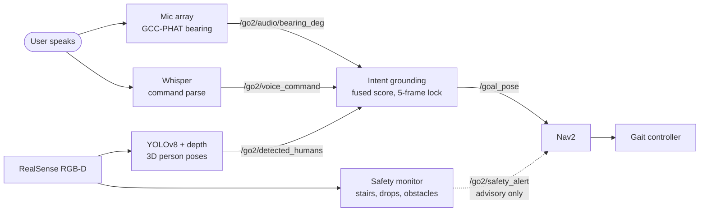

# GO2 Seeing-Eye Dog

**A ROS 2 stack that lets a blind or low-vision user call a Unitree GO2 quadruped across a room by speaking to it, and have the robot work out who called, where that person is standing, and walk to them.**

A guide dog has to be summonable. If the handler puts the harness down, sits on a bench, and then wants the dog back, the dog finds them by voice, not by an app or a joystick. A quadruped that needs a phone screen or a controller to be recalled is useless to the person it was bought for. That is the specific gap this repository closes: the recall half of the interaction, running on the real robot rather than in simulation, using only the microphones and the RGB-D camera the robot carries.

This repository is the hardware path. It is not the simulation workspace, and it does not contain a full autonomy state machine.

## One interaction, end to end

The user is roughly four metres away, off to the robot's left, in a room with two other people in frame. They say "hey robot, come here."

| Step | What happens | Evidence in the code |
|---|---|---|
| 1. Hear | A four-channel linear mic array (5 cm spacing) segments a 3-second window once the frame energy crosses a threshold, then runs GCC-PHAT across channel pairs for a time delay and an azimuth. | `go2_audio_perception/audio_perception_node.py`, published on `/go2/audio/bearing_deg` |
| 2. Understand | Whisper (`base.en`) transcribes the same window, and a keyword map turns free text into one of `come here`, `follow`, `stop`, `help`. | `go2_voice_commander/voice_commander_node.py`, published on `/go2/voice_command` |
| 3. See | YOLOv8 detects people in the RealSense RGB frame, and each box is back-projected through the depth image and camera intrinsics into a 3D pose. | `go2_perception/perception_node.py`, published on `/go2/detected_humans` |
| 4. Decide who | Each detected person gets a fused score, `0.4 * audio + 0.6 * visual`, where the audio term decays linearly to zero at 25 degrees away from the measured bearing. A stale bearing (older than 2 s) drops the person to visual only, scaled by 0.7. | `go2_intent_grounding/fusion.py` |
| 5. Commit | The best person must clear a fused score of 0.65 on 5 consecutive frames before the target locks. The locked pose is transformed from the camera optical frame into `map` via TF2 and published as a Nav2 goal. | `go2_intent_grounding/intent_grounding_node.py`, published on `/go2/confirmed_target` and `/goal_pose` |
| 6. Watch the floor | While Nav2 drives, the depth image is checked for a forward obstacle (slow at 1.0 m, stop at 0.4 m), a stair-like gradient in the floor band, and a curb or drop. | `go2_safety_monitor/safety_monitor_node.py`, published on `/go2/safety_alert` |



The dashed arrow is deliberate. The safety monitor publishes alerts, but no behavior-tree condition node currently hard-gates motion on them. That is the most important open item in this repository.

## Status

Unitree GO2 EDU with an onboard Jetson, ROS 2 Humble. Split by what has actually been run, not by what exists.

| Capability | Implemented | Unit-tested | Validated on the robot |
|---|---|---|---|
| Audio bearing (GCC-PHAT) | Yes | Yes | No, thresholds are mic- and mount-specific |
| Voice command parsing (Whisper) | Yes | Yes | No |
| NeMo ASR bridge | Yes | No | No |
| Person detection (YOLOv8 + depth back-projection) | Yes, stock `yolov8n` weights | No | No |
| Intent grounding and fusion | Yes | Yes | No |
| Safety monitor (stairs, drops, obstacles) | Yes | No | No |
| Gait controller (C++ lifecycle node) | Yes, CI build passing | No | No |
| Nav2 params and recovery behavior tree | Configured | No | No |
| Safety alerts hard-gating motion | **No**, alerts are advisory | n/a | n/a |
| `follow` and `help` commands | Parsed and published, **not consumed** downstream | n/a | n/a |
| Guiding or leading the user | **Not implemented**, this repo recalls the robot, it does not walk the user anywhere | n/a | n/a |
| End-to-end recall on hardware | In progress, live sensor TF and Nav2 runtime pending | n/a | No |

32 unit tests pass locally (`go2_audio_perception`, `go2_voice_commander`, `go2_intent_grounding`, `evaluation`). Every number quoted above is a default parameter value in the source, not a measured field result. Nothing in this repository has a published accuracy or latency measurement on the real robot yet.

A custom four-class perception model (owner, wrist marker, phone marker, follow marker) is specified in [DATA.md](DATA.md), but the dataset is still being collected and the shipped default is stock YOLOv8.

## Repository Layout

```text
go2_audio_perception/   GCC-PHAT bearing estimate and NeMo ASR bridge
go2_voice_commander/    Whisper-based command parsing
go2_perception/         YOLOv8 + depth back-projection
go2_intent_grounding/   Audio/voice/vision target confirmation
go2_safety_monitor/     Depth-based hazard detection
go2_navigation/         Nav2 params and behavior trees
go2_bringup/            Top-level launch files
go2_msgs/               Shared ROS 2 message definitions
go2_gait_controller/    C++ lifecycle gait controller
evaluation/             Offline evaluation utilities and tests
scripts/                Deterministic repo-local workflow entrypoints
docs/                   Architecture, debugging, ROS graph, release docs
```

## Setup

1. Install ROS 2 Humble and source it.
2. Install system dependencies required by this repo:
   - `python3-pip`
   - `python3-colcon-common-extensions`
   - `python3-rosdep`
   - `portaudio19-dev`
3. Bootstrap Python and ROS dependencies:

```bash
./scripts/bootstrap.sh
```

If `rosdep` or ROS 2 is missing, the bootstrap script will say so instead of pretending the environment is complete.

## Build

```bash
source /opt/ros/humble/setup.bash
colcon build --symlink-install --packages-select go2_msgs
source install/setup.bash
colcon build --symlink-install --packages-up-to go2_bringup
```

Why `go2_msgs` first: the Python packages depend on generated interfaces. Failing to build messages first creates avoidable import breakage.

## Test And Validate

Run these before claiming progress:

```bash
./scripts/lint.sh
./scripts/test.sh
./scripts/validate.sh
```

What they cover:

- `scripts/lint.sh`: `ruff` plus XML sanity for behavior trees
- `scripts/test.sh`: deterministic Python unit tests
- `scripts/validate.sh`: Python bytecode compilation and repo contract checks

## Run

Real hardware bringup:

```bash
source /opt/ros/humble/setup.bash
source install/setup.bash
./scripts/run.sh
```

Optional launch controls:

```bash
LOG_LEVEL=debug ./scripts/run.sh
USE_SIM=true ./scripts/run.sh
```

`USE_SIM=true` now fails fast on purpose. This repo does not package a simulator path, and pretending otherwise is how robotics repos rot.

## Troubleshooting

- Missing package error during launch:
  run `./scripts/validate.sh` and check whether `nav2_bringup`, `realsense2_camera`, and repo packages resolve in the active ROS environment.
- Launch dies with behavior tree error:
  ensure `go2_navigation/behavior_trees/navigate_to_pose_recovery.xml` is installed by rebuilding `go2_navigation`.
- No `/goal_pose` output:
  check `ros2 run tf2_ros tf2_echo map camera_color_optical_frame` and verify the camera frame can transform into `map`.
- Perception idle:
  verify `/camera/color/image_raw`, `/camera/depth/image_rect_raw`, and camera info topics are publishing.
- Safety monitor never alerts:
  inspect `/go2/safety_state` and confirm depth values are nonzero and in millimeters.
- Voice command quality is poor:
  retune `energy_threshold` for the actual microphone chain and ambient noise level.

## Operational Notes

- Camera streams are subscribed with `BEST_EFFORT`; camera-info QoS compatibility still needs runtime verification against the actual driver.
- Audio thresholds and hazard thresholds are hardware- and mounting-dependent. Do not treat them as portable constants.

## Audio Compatibility

| Model | Audio | Notes |
|---|---|---|
| Go2 EDU | Yes | Microphone hardware present and captured on the unit used here |
| Go2 Pro | Yes | Expected to work (same hardware) |
| Go2 Air | No | No microphone hardware |

## Documentation

- `docs/architecture.md`
- `docs/debugging.md`
- `docs/ros_graph.md`
- `docs/hardware_assumptions.md`
